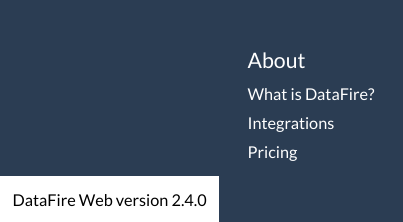

# DataFire.io-Website

Open an [issue here](https://github.com/DataFire/DataFire.io-Website/issues) for any questions, suggestions, or bugs related to [DataFire.io](https://app.datafire.io) 

## Checking Your Version
To make sure you're on the latest version, hit the "refresh" button in your browser while on app.datafire.io.

To check which version you're using:
* Visit the homepage at app.datafire.io
* Scroll down to the bottom
* Hover your mouse over the bottom-left corner

You should see something like this:

